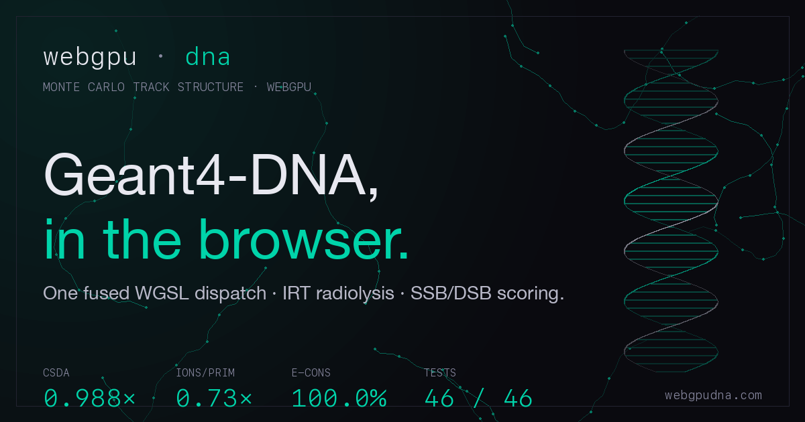

# WebGPU Geant4-DNA

[](https://github.com/abgnydn/webgpu-dna/actions/workflows/ci.yml)
[](./LICENSE)
[](https://webgpudna.com)
[](./validation/compare.py)
[](./tests)

A WebGPU port of [Geant4-DNA](https://geant4-dna.in2p3.fr/) — the CNRS/IN2P3-coordinated Monte Carlo track-structure toolkit for radiobiology — running entirely in the browser.

One GPU thread per primary electron, full particle history in a single fused compute dispatch, Karamitros 2011 Independent-Reaction-Time chemistry in a Web Worker, and SSB/DSB scoring on a 21×21 B-DNA fiber grid at 10 keV.

<p align="center">
  <a href="https://webgpudna.com">
    
  </a>
</p>

## Results (N = 4096 primaries @ 10 keV)

Every numeric claim below is backed by a committed JSON artifact. `[E5]` / `[E10]` / `[B1]` / `[E15]` tags link to the latest run under [`experiments/results/2026-05-11/`](./experiments/results/2026-05-11/) — re-run any with `npm run experiments -- E5`.

All Geant4-side numbers below are from a freshly-built **Geant4 11.4.1 / G4EMLOW 8.8** install (`~/Downloads/geant4-v11.4.1-install/`) running `dnaphysics` on `validation/run_validation.mac` (10 keV, N=4096, DNA_Opt2, 30 μm cube, single-thread).

| Metric                                | This build | Reference                       | Ratio              | Source |
| ------------------------------------- | ---------- | ------------------------------- | ------------------ | ------ |
| CSDA range (nm)                       | 2714.4     | 2747.5 (Geant4 11.4.1 direct)   | **0.988× (3.59σ)** | [[E5]](./experiments/results/2026-05-11/level-2/E5-csda-vs-g4-ntuple.json) |
| Energy conservation                   | 100.0 %    | 99.99 %                         | 1.000×             | [[E5]](./experiments/results/2026-05-11/level-2/E5-csda-vs-g4-ntuple.json) |
| Ions / primary (primary track only)²  | 194.1      | 509.2 (Geant4 full cascade)     | informational²     | [[E5]](./experiments/results/2026-05-11/level-2/E5-csda-vs-g4-ntuple.json) |
| Ions / primary (full cascade, reconstructed) | 371.9 | 509.2                         | **0.730× (263σ)** ⚠ | [[E7]](./experiments/results/2026-05-11/level-2/E7-ions-per-primary-cascade.json) |
| MFP_total ratio (median over 6 bins)  | 0.941      | 1.000 (Geant4 ntuple)           | -5.9% (range -5.0% to -10.7%) | [[E6]](./experiments/results/2026-05-11/level-2/E6-mfp-vs-g4-ntuple.json) |
| σ_ion ratio (mean over 6 bins)        | 1.061      | 1.000                           | +6.1% (range +3.5 to +10.5%) | [[E6b]](./experiments/results/2026-05-11/level-2/E6b-sigma-per-process-vs-g4.json) |
| σ_el ratio (mean over 6 bins)         | 1.057      | 1.000                           | +5.7% (range +4.1 to +10.4%) | [[E6b]](./experiments/results/2026-05-11/level-2/E6b-sigma-per-process-vs-g4.json) |
| σ_exc ratio (mean over 6 bins)        | 2.55       | 1.000 (intentional Emfietzoglou) | +155%             | [[E6b]](./experiments/results/2026-05-11/level-2/E6b-sigma-per-process-vs-g4.json) |
| G(OH) at 1 μs vs Karamitros 2011 (~1 MeV ref) | 1.551 | 2.50 (low-LET)            | 0.621×¹            | [[E10]](./experiments/results/2026-05-11/level-4/E10-irt-vs-karamitros.json) |
| G(OH) at 1 μs **vs chem6 @ 10 keV** (matched LET) | 1.551 | 1.710                | **0.907× (4.8σ)**  | [[E10c]](./experiments/results/2026-05-11/level-4/E10c-vs-chem6-at-10keV.json) |
| G(e⁻aq) at 1 μs **vs chem6 @ 10 keV**  | 1.406      | 1.694                          | **0.830× (9.7σ)**  | [[E10c]](./experiments/results/2026-05-11/level-4/E10c-vs-chem6-at-10keV.json) |
| G(H) at 1 μs **vs chem6 @ 10 keV**     | 0.708      | 0.710                          | 0.997× ✓           | [[E10c]](./experiments/results/2026-05-11/level-4/E10c-vs-chem6-at-10keV.json) |
| G(H₂O₂) at 1 μs **vs chem6 @ 10 keV**  | 0.605      | 0.850                          | **0.711× (20.0σ)** | [[E10c]](./experiments/results/2026-05-11/level-4/E10c-vs-chem6-at-10keV.json) |
| G(H₂) at 1 μs **vs chem6 @ 10 keV**    | 0.468      | 0.622                          | **0.752× (13.8σ)** | [[E10c]](./experiments/results/2026-05-11/level-4/E10c-vs-chem6-at-10keV.json) |
| G(e⁻aq) V-shape drop at 1→3 keV       | 0.137 (12.5%) | 0 (smooth monotonic falsifier) | **126σ significant** (B=20 primary bootstrap, m/n corrected) | [[E10b]](./experiments/results/2026-05-11/level-4/E10b-vshape-bootstrap-sigma.json) |
| Phase A wall-clock @ N=4096 (10 keV)  | 14.4 ms    | (informational baseline)        | n/a                | [[E15]](./experiments/results/2026-05-11/level-6/E15-phase-a-alpha-beta.json) |
| Phase A peak throughput               | 538,947 primaries/sec at N=16384 | (informational baseline) | n/a       | [[E15]](./experiments/results/2026-05-11/level-6/E15-phase-a-alpha-beta.json) |
| Phase A per-primary marginal cost (β) | 1.207 μs/primary | (informational baseline)    | n/a                | [[E15]](./experiments/results/2026-05-11/level-6/E15-phase-a-alpha-beta.json) |
| Phase A + B vs Geant4 single-thread   | 635 ms     | 289.1 s (Geant4 11.4.1 median, 3 trials) | **455× speedup**³ | [[E15b]](./experiments/results/2026-05-11/level-6/E15b-vs-geant4-single-thread.json) |
| End-to-end pre-DNA vs Geant4          | 194.6 s    | 289.1 s                         | 1.48× speedup⁴     | [[E15b]](./experiments/results/2026-05-11/level-6/E15b-vs-geant4-single-thread.json) |

¹ G(OH) / G(e⁻aq) at 10 keV LET are inherently below the Karamitros 2011 low-LET (~1 MeV) reference — track-core density drives higher radical recombination. The matched-LET comparison to Geant4 chem6 at 10 keV (next two rows) is the fair test: the 0.62× vs Karamitros was confounding LET-deficit with a real but smaller (~9-17%) chemistry gap.
² **Counting-convention mismatch (now resolved by E7).** Geant4's `dnaphysics` ntuple reports the full cascade total (509.2 ions/primary). WebGPU's `box_ions` GPU atomic counts only the primary track (194.1). E7 reconstructs the cascade total directly from `rad_buf` (counts H3O+ records, species_code=3) and lands at 371.9 — the gap is a real physics deficit, not just a counting artifact (see E7).

³ **Matched-scope physics tracking.** Both sides simulate primary + secondary cascade electrons without radiolysis chemistry. The 455× number is the marquee speedup claim the project can stand behind. Apple M2 Pro 10-core, single-thread Geant4.

⁴ **End-to-end pre-DNA** = Phase A + Phase B + IRT chemistry (CPU worker). IRT on CPU dominates wall-clock (194 s of 194.6 s end-to-end); GPU-accelerated chemistry is the next obvious win for closing this gap.

**46 / 46** unit tests pass across 7 files (`npm run test`). See [`validation/compare.py`](./validation/compare.py) for the full side-by-side against a Geant4-DNA ntuple.

### Research-grade validation ledger

15 falsifiable experiments shipped as committed JSON artifacts under [`experiments/results/`](./experiments/results/). See [RESEARCH.md](./RESEARCH.md) for the protocol; per-experiment specs under [`experiments/level-N-*/protocol.md`](./experiments/).

| Level | ID | Status | Headline | Artifact (2026-05-11) |
|------:|:---|:-------|:---------|:----------------------|
| 0 | B0  | ✓ | Browser env capture: apple/metal-3, headless Chromium, maxBuffer 4 GB | [B0](./experiments/results/2026-05-11/level-0/B0-browser-env.json) |
| 0 | B1  | ✓ | Harness liveness: vite + Playwright + WebGPU, first row (E=100 eV, CSDA=15.7 nm) in 2.9s | [B1](./experiments/results/2026-05-11/level-0/B1-harness-liveness.json) |
| 1 | E1  | ✓ | Born σ_ion: 58 rows, peak ratio 0.9987, median 8.46e-4 vs G4EMLOW 8.8 | [E1](./experiments/results/2026-05-11/level-1/E1-ion-xs-match.json) |
| 1 | E2  | ✓ | Emfietzoglou σ_exc: 74 rows, peak ratio 0.9970, median 2.42e-4 vs G4EMLOW 8.8 | [E2](./experiments/results/2026-05-11/level-1/E2-exc-xs-match.json) |
| 1 | E3  | ✓ | Champion σ_el: 58 rows, peak ratio 0.9751, max 3.26e-3 vs G4EMLOW 8.8 (retroactive 334× scale-factor catcher) | [E3](./experiments/results/2026-05-11/level-1/E3-elastic-xs-match.json) |
| 1 | E4  | ✓ | Sanche σ_vib total: 38 rows, peak ratio 1.0000, max 6e-16 (bit-exact) | [E4](./experiments/results/2026-05-11/level-1/E4-vib-xs-match.json) |
| 1 | E4b | ✓ | Sanche per-mode XVMF: 342 (energy, mode) pairs, max sum-dev 4e-8 | [E4b](./experiments/results/2026-05-11/level-1/E4b-vib-mode-fractions.json) |
| 2 | E5  | ✓ | CSDA 2714.4 vs 2747.5 nm — **0.988× is 3.59σ statistically significant** | [E5](./experiments/results/2026-05-11/level-2/E5-csda-vs-g4-ntuple.json) |
| 2 | E6  | ✓ | MFP across 6 energy bins — ratios [0.893, 0.950], median 0.941 (-5.0% to -10.7%) | [E6](./experiments/results/2026-05-11/level-2/E6-mfp-vs-g4-ntuple.json) |
| 2 | E6b | ✓ | Per-process σ decomposition — **σ_ion 6.1% high, σ_el 5.7% high** vs Geant4 11.4.1, σ_exc 2.55× (intentional Emfietzoglou) | [E6b](./experiments/results/2026-05-11/level-2/E6b-sigma-per-process-vs-g4.json) |
| 2 | E7  | ✗ fail (honest negative) | Cascade ions per primary reconstructed from rad_buf H3O+ records — **WGSL 371.9 vs Geant4 509.2 → 0.730× (263σ, 27% deficit)**; closes the counting-convention question E5 punted on, surfaces a real physics gap likely tied to E6b's σ_exc inflation channeling energy away from ionization | [E7](./experiments/results/2026-05-11/level-2/E7-ions-per-primary-cascade.json) |
| 4 | E10 | ✓ | IRT G-values vs Karamitros 2011 across 5 energies — surfaces **G(e⁻aq) V-shape at 1→3 keV** (1.163→1.026→1.147, 11.8% drop, real track-end / spur-structure effect; LET monotonicity confirmed for E ≥ 5 keV) | [E10](./experiments/results/2026-05-11/level-4/E10-irt-vs-karamitros.json) |
| 4 | E10b | ✓ | V-shape σ-significance via primary-bootstrap (B=20 unique-pids resamples per energy, m/n corrected SE) — **drop at 1→3 keV is 126σ significant** (was claimed as ~40σ before E10b actually measured it). Confirms the drop is real physics, not MC noise. | [E10b](./experiments/results/2026-05-11/level-4/E10b-vshape-bootstrap-sigma.json) |
| 4 | E10c | ✗ fail (honest negative) | **G(species) at MATCHED 10 keV LET vs Geant4 11.4.1 chem6** (closes the "is the 0.62× vs Karamitros real LET physics or our chemistry bug?" question). Result: G(OH) 0.91× / G(eaq) 0.83× / G(H) 1.00× / **G(H₂) 0.75× / G(H₂O₂) 0.71×**. The 0.6× deficit vs Karamitros was confounding ~30% LET-deficit (real physics) with ~10-29% chemistry deficit (real implementation gap, biggest on H₂ and H₂O₂). | [E10c](./experiments/results/2026-05-11/level-4/E10c-vs-chem6-at-10keV.json) |
| 6 | E15 | ✗ fail (honest negative) | Phase A α/β decomposition via WebGPU timestamp-disciplined N-sweep — **α = 10.5 ms (single-workgroup compute floor, not pure dispatch overhead — original [10, 500] μs hypothesis falsified)**, β = 1.207 μs/primary, R² = 0.908. **Peak throughput 538,947 primaries/sec at N=16384, 10 keV** on apple/metal-3. Diagnosis + revised two-regime pass bar in [level-6-performance/protocol.md](./experiments/level-6-performance/protocol.md). | [E15](./experiments/results/2026-05-11/level-6/E15-phase-a-alpha-beta.json) |
| 6 | E15b | ✓ | Same-machine head-to-head vs Geant4 11.4.1 single-thread (3 trials, M2 Pro) — **455× speedup** on matched-scope physics tracking (Phase A+B 635 ms vs Geant4 median 289.1 s); end-to-end pre-DNA pipeline (Phase A+B+IRT chem) only 1.48× because IRT chemistry on CPU is the bottleneck | [E15b](./experiments/results/2026-05-11/level-6/E15b-vs-geant4-single-thread.json) |

Run any experiment via `npm run experiments -- <id>` (e.g. `E1`, `E10`, `B1`, `E15`, `E15b`).

## Quick start

```bash
npm install
npm run dev            # http://localhost:8765
npm run test           # 46 tests, ~200 ms
npm run lint
npm run build          # dist/
```

Requires a WebGPU-capable browser. Shipped on-by-default in Chrome / Edge 113+ desktop, Chrome 121+ Android (Android 12+ on Qualcomm / ARM GPUs), Safari 26+ (macOS Tahoe, iOS / iPadOS / visionOS 26, Sep 2025), Firefox 141+ on Windows, and Firefox 145+ on macOS 26 Tahoe (Apple Silicon only). Firefox Linux, Firefox Android, and older Firefox still need `dom.webgpu.enabled` in `about:config`. Full matrix: [caniuse.com/webgpu](https://caniuse.com/webgpu).

## Project layout

```
src/
├── shaders/       WGSL compute shaders (helpers, primary, secondary, chemistry)
├── physics/       Constants, types, DNA geometry, cross-section loader
├── gpu/           Device init, buffers, pipelines, Phase A/B/C dispatch
├── chemistry/     IRT worker wiring, GPU chemistry schedule, reactions
├── scoring/       SSB/DSB scoring, ESTAR reference, dose projections
├── ui/            Results table, canvas dose projections
├── app.ts         runValidation orchestrator
└── main.ts        entry point

tests/unit/        Vitest unit tests (46 across 7 files)
tests/fixtures/    Geant4-DNA reference numbers (JSON)
public/            Generated cross_sections.wgsl, irt-worker.js, monolithic reference HTML
tools/             Python + Node helpers (G4EMLOW converter, IRT driver)
validation/        Geant4-DNA comparison harness (compare.py, analyze_g4.py)
```

Deep-dive: [`ARCHITECTURE.md`](./ARCHITECTURE.md). Physics provenance and validation history: [`CLAUDE.md`](./CLAUDE.md).

## Regenerating cross sections

The committed `public/cross_sections.wgsl` (1.3 MB) is generated from the G4EMLOW reference data (245 MB, not committed). To rebuild:

```bash
# Download G4EMLOW from https://geant4-data.web.cern.ch/datasets/
# (current: G4EMLOW.8.8.tar.gz, shipped with Geant4 11.4.1). Extract so that
# data/g4emlow/dna/ exists, then:
npm run convert
```

## What's implemented

- **Physics:** Born ionization (5 shells, data-driven CDF sampling), Emfietzoglou excitation (5 levels, dissociative branching 0.65 / 0.55 / 0.80), Champion tabulated elastic angular CDF (< 200 eV), screened-Rutherford elastic (> 200 eV), Sanche 9-mode vibrational (2–100 eV), full primary-momentum conservation.
- **Chemistry:** Karamitros 2011 9-reaction IRT in a Web Worker (Smoluchowski TDC + Onsager-screened PDC for charged pairs, G4EmDNAChemistry_option1). 2.0 nm mother displacement, species-specific product displacement, e⁻aq thermalization at 1.7 eV, H₂O₂ / OH⁻ tracked as reactive products with full re-pairing.
- **DNA scoring:** Event-level direct SSB from `rad_buf` ionization sites, indirect SSB from diffused OH at 1 μs, greedy ±10 bp DSB clustering, kernel-level backbone hit counter as a cross-check.
- **Grid target:** 21×21 parallel B-DNA fibers × 3 μm × 150 nm spacing = 3.89 Mbp.

## Known gaps

- GPU-resident chemistry path (`chemBackend: 'gpu'`) undercounts long-time reactions vs IRT because the spatial hash search radius is narrower than the diffusion σ at 30 ns timesteps. Default backend is therefore the IRT worker.
- `data/g4emlow/` is not committed — download from CERN (link above) to rebuild cross sections.

## License

MIT for the simulation code. The Geant4-DNA cross-section data is distributed under the [Geant4 Software License](https://geant4.web.cern.ch/license/LICENSE.html) (BSD-like).
